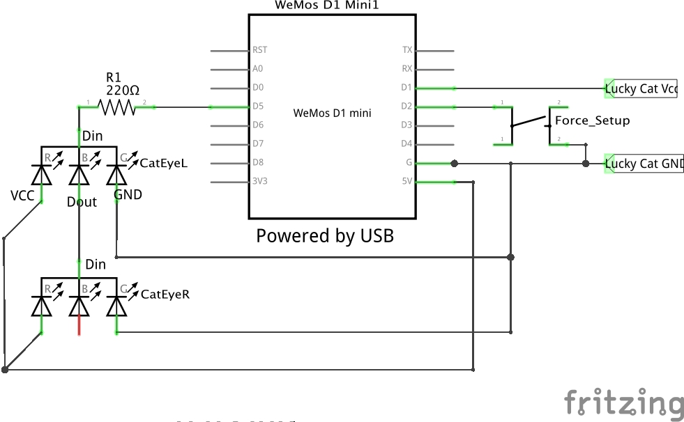

## ESP8266 enabled lucky cat

Code derived from https://github.com/themad/jimmykater

### Changes:
* Keeps lights on. So, continuous lighting.
* More light effects
* Keeps original waving mechanism. ( Instead of using a Servo )
* mqtt authentication support (can be configured in wifi captive portal)
* a lot of stuff

### MQTT Topics:

* catname/eye/mode/set   [solid|warp|blink]
* catname/eye/speed/set  [slow|med|fast]
* catname/eye/color/set  [dark|white|red|green|blue|yellow|cyan|pink]
* catname/paw/command    [wink|nowink]

### Demo Time!

<iframe src="https://player.vimeo.com/video/198570621" width="640" height="360" frameborder="0" webkitallowfullscreen mozallowfullscreen allowfullscreen></iframe>

<a href="https://vimeo.com/198570621">Monicat</a> from <a href="https://vimeo.com/user1086940">Bjoern Pohl</a> on <a href="https://vimeo.com">Vimeo</a>.

### Hardware

Pinouts are currently set to a wemos d1 mini which fits nicely into such a cat. But I guess any 8266 excep a ESP01 will do it somehow. 

* 8266 : Wemos D1 Mini
  * at least three GPIOs:
    * "Force Setup" Button
    * LED Data input (only one for both leds, both could(!) be controlled individually, anyway.
    * Waving "electronic" from Cat :)
* pushbutton ( "force setup button")
* Cat : 22cm (~9 inch) lucky cat
* Adafruit addressable LEDs: https://www.sparkfun.com/products/12999
* 220 Ohm Resistor in Data line to the LEDs.
* A lot of hot glue.

Original lucky cat electronic can directly be driven by gpio (4-10mAh).

Code needs to be wiped through. A lot of Spaghetti and globals layin on the ground...

Blog Post here: https://www.datenwalze.de/post/monicat/ 

